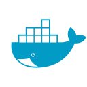
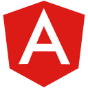

# ValiantHarold

<!--
**ValiantHarold/ValiantHarold** is a ✨ _special_ ✨ repository because its `README.md` (this file) appears on your GitHub profile.

Here are some ideas to get you started:

- 🔭 I’m currently working on ...
- 🌱 I’m currently learning ...
- 👯 I’m looking to collaborate on ...
- 🤔 I’m looking for help with ...
- 💬 Ask me about ...
- 📫 How to reach me: ...
- 😄 Pronouns: ...
- ⚡ Fun fact: ...
-->

### 🧰 Languages and Tools

   <!-- Languages -->
   
   
   
   
   

   <!-- Source Control -->
   
   
   

   <!-- Technologies -->
   
   
   
   
   
   
   

   <!-- Databases -->
   
   
   

   <!-- Building Blocks -->
   
   
   
   

   <!-- Tools -->
   
   
   

### 📊 Stats

   <picture>
      <source media="(prefers-color-scheme: dark)" srcset="https://github-readme-stats.vercel.app/api?username=ValiantHarold&count_private=true&show_icons=true&hide=stars&theme=tokyonight">
      
   </picture>

   <picture>
      <source media="(prefers-color-scheme: dark)" srcset="https://github-readme-stats.vercel.app/api/top-langs/?username=ValiantHarold&layout=compact&theme=tokyonight">
      
   </picture>

<!-- May use later -->
<!--  -->
